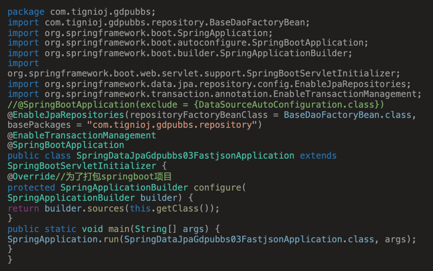

# Highlight code for OneNote
# 预览
1. 下载代码到本地
2. 执行`gohttpserver`
3. 粘贴代码到textarea

主题
https://highlightjs.org/static/demo/


# 开发背景
我们使用IDEA写代码的时候，可能会记录一些代码到OneNote，但是在黑暗模式下，直接粘贴的效果非常糟糕(代码的背景莫名其妙变成了浅色)。

在Windows下我们可以通过Visual Studio Code作为IDEA到OneNote的媒介解决这个问题, 但是在MacOS下, 发现Visual studio code复制的所有代码粘贴到OneNote首行所有缩进都会被吞掉。
变成如下效果



# 解决方案
为了解决MacOS使用OneNote无法代码高亮的情况，经过尝试，有如下方案。
## 方案一(最省时间)：
网上随便找一个代码高亮，复制IDEA的代码，然后经过网页渲染

步骤：

IDEA->网页渲染代码高亮->OneNote

### 现有网页
1. http://hilite.me/
    这个使用了python作为后端，网页没有提供复制功能，只能自己手动复制
2. https://tohtml.com
    这个不知道后端是什么，网页提供了复制，但是中文会乱码


## 方案二(多了一步，但是效果还不错): 

步骤：

IDEA->VSC->Word->OneNote

没错，用Word做中转，效果还可以, 注意从VSC->Word这一步，Word要选择性粘贴为带格式的文本，而不是HTML或者纯文本。

## 方案三(效果最好，最耗资源):不用Mac,用虚拟机Parallel Desktop或者Vmware

使用虚拟机安装Win10再安装VSC和OneNote

效果最好，最占用资源。但是做个笔记还要开个虚拟机，这有点为难我的低压CPU了

## 方案四(类似方案一(本项目))

可以高度自定义, 动手成本稍微高, 但是我这里都给你搭建好了，直接打开[这里](https://tignioj.github.io/copy-highlight-code)用就行。

# 如何自定义高亮
1. 下载项目
2. 更改style.css

说明： 项目下的styles文件夹都是highlightjs官方的样式文件，看中哪一个直接粘贴到与index.html同级目录下的style.css就可以。

# 高亮库
## 1. highlight.js


# 复制高亮代码-实现的思路
复制代码有两种不同的思路，一种是直接复制html，另一种是直接复制渲染后的样式。
## 思路1. 直接复制html
```java
public class User {
    private int userNumber;
    private String userName;

    public User(int userNumber, String userName) {
        this.userNumber = userNumber;
        this.userName = userName;
    }
}
```
那么经过html处理，大概代码就变成这样


    <pre style='color:#000000;background:#ffffff;'><span style='color:#800000; font-weight:bold; '>public</span> <span style='color:#800000; font-weight:bold; '>class</span> User <span style='color:#800080; '>{</span>
    <span style='color:#800000; font-weight:bold; '>private</span> <span style='color:#bb7977; '>int</span> userNumber<span style='color:#800080; '>;</span>
    <span style='color:#800000; font-weight:bold; '>private</span> <span style='color:#bb7977; font-weight:bold; '>String</span> userName<span style='color:#800080; '>;</span>

    <span style='color:#800000; font-weight:bold; '>public</span> User<span style='color:#808030; '>(</span><span style='color:#bb7977; '>int</span> userNumber<span style='color:#808030; '>,</span> <span style='color:#bb7977; font-weight:bold; '>String</span> userName<span style='color:#808030; '>)</span> <span style='color:#800080; '>{</span>
        <span style='color:#800000; font-weight:bold; '>this</span><span style='color:#808030; '>.</span>userNumber <span style='color:#808030; '>=</span> userNumber<span style='color:#800080; '>;</span>
        <span style='color:#800000; font-weight:bold; '>this</span><span style='color:#808030; '>.</span>userName <span style='color:#808030; '>=</span> userName<span style='color:#800080; '>;</span>
    <span style='color:#800080; '>}</span>
    </pre>
    <!--Created using ToHtml.com on 2021-06-11 09:28:09 UTC -->


这种情况仅仅适合每个高亮都内置了内联样式，当使用外联样式都时候，复制html都方法不再生效，因为你没办法把外联样式一起复制过去。

## 思路2：模仿用户选择复制
当使用外联样式时候，只能使用这个方法了。

不知道剪贴板存储的内容是什么，直接粘贴在能格式化的地方就能看到文本。

js实现代码
```javascript
    document.getElementById("button-copy").addEventListener("click", function (ev) {
        var codeEle = document.getElementById('mycode');
        const selection = window.getSelection();
        // Save the current selection
        const currentRange = selection.rangeCount === 0
            ? null : selection.getRangeAt(0);

        // Select the text content of code element
        const range = document.createRange();
        range.selectNodeContents(codeEle);
        selection.removeAllRanges();
        selection.addRange(range);

        // Copy to the clipboard
        try {
            document.execCommand('copy');
            document.getElementById("copiedNotice").innerHTML = 'Copied';
        } catch (err) {
            // Unable to copy
            document.getElementById("copiedNotice").innerHTML = 'Copy';
        } finally {
            // Restore the previous selection
            selection.removeAllRanges();
            currentRange && selection.addRange(currentRange);
        }
    })
```

# 参考
- 复制代码实现的思路2： https://htmldom.dev/copy-highlighted-code-to-the-clipboard/
